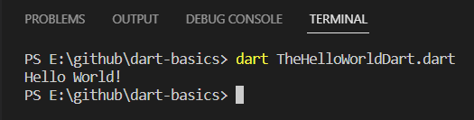

# dart-basics
Basics of Dart programming language for beginners.

## what is Dart and why do we use it ?
Dart is a programming language developed by Google. It is used to build web, mobile, and desktop applications, and can also be used for server-side development. Dart is designed to be easy to learn and use, with a syntax similar to that of other popular languages such as Java and JavaScript. It also includes features such as garbage collection, type inference, and a built-in package manager. Dart is used in the development of the Flutter framework for building cross-platform mobile apps.

## requirements
- Install Dart Sdk from [here](https://dart.dev/get-dart/archive).
- Install VS Code from [here](https://code.visualstudio.com/download).
- Install `Dart` and `Dart (Syntax Highlighting Only)` extensions in VS Code.

## setup steps
- Checkout [this](https://github.com/rahulrajpandey/dart-basics.git) repository. 
```
git clone https://github.com/rahulrajpandey/dart-basics.git
```

## running code
- Open the cloned repository folder in VS Code in your local machine.
- Test with HelloWorld program first:
  - Open Terminal in VS Code.
  - Type: ``` dart TheHelloWorldDart.dart ``` and hit Enter.
  - If it gives the following result, you are done with the setup.
  
  - Now, try running rest of the code files one by one to learn Dart basics and essentials.

## learning the concepts
- Open the folders and files in their order of numbering.
- Each file contains the topic, its concepts and examples.
  - Read the concept section first.
  - Then glance over the given examples for better understanding.
  - Run the file and check the output.
- Once you understood the topic, create a new file for your practice with the name of the topic.
  - Try writing few more examples or re-write the example from repository file, and then try to run.
  - It will solidify your understanding on the topic.

Connect with me on [LinkedIn](https://www.linkedin.com/in/rahulrajpandey/) [Twitter](https://twitter.com/rrprahulraj).

Happy Dart Learning :smiling_face_with_three_hearts:

Thanks :handshake:
